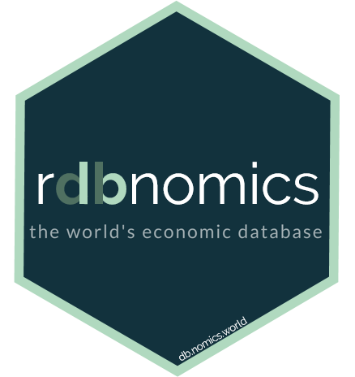

# rdbnomics 

[](https://cran.r-project.org/package=rdbnomics)
[](https://cran.r-project.org/package=rdbnomics)
[](https://git.nomics.world/dbnomics/rdbnomics/commits/master)
[](https://CRAN.R-project.org/package=rdbnomics)

## DBnomics R client

This package provides you access to DBnomics data series. DBnomics is an open-source project with the goal of aggregating the world's economic data in one location, free of charge to the public. DBnomics covers hundreds of millions of series from international and national institutions (Eurostat, World Bank, IMF, ECB, ...).

To use this package, you have to provide the codes of the provider, dataset and series you want. You can retrieve them directly on the <a href="https://db.nomics.world/" target="_blank">website</a>. You have access to the API through this <a href="http://api.db.nomics.world/" target="_blank">link</a> and the documentation is <a href="https://api.db.nomics.world/v22/apidocs" target="_blank">here</a>.

DBnomics is hosted on its own <a href="https://git.nomics.world/" target="_blank">gitlab platform</a>. However, in order to install the package more easily, we created a mirror of this package on <a href="https://github.com/dbnomics/rdbnomics" target="_blank">github</a>.

To install `rdbnomics` from CRAN:

```r
install.packages("rdbnomics")
library(rdbnomics)
```

To install `rdbnomics` from github:

```r
remotes::install_github("dbnomics/rdbnomics", build_vignettes = TRUE, force = TRUE)
library(rdbnomics)
```

After installation, a vignette is available to the user with:

* many examples,
* how to configure a proxy,
* how to use default R internet connection,
* transform time series with filters,
* ...

Just follow the link <a href="https://CRAN.R-project.org/package=rdbnomics/vignettes/rdbnomics.html" target="_blank">rdbnomics</a> or run:
```r
vignette("rdbnomics")
```
A lot of examples are available in the functions' documentations:
```r
?rdb
?rdb_datasets
?rdb_dimensions
?rdb_series
?rdb_providers
?rdb_last_updates
?rdb_to_xts
?rdb_rename_xts
```

## P.S.
Visit <a href="https://db.nomics.world/" target="_blank">https://db.nomics.world/</a> !
