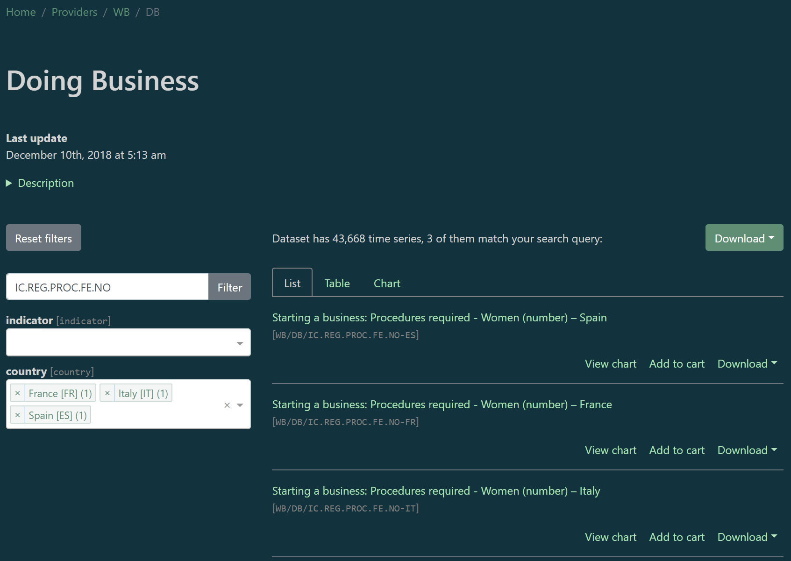
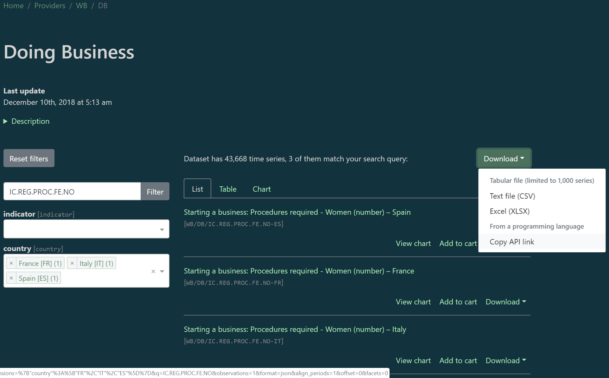
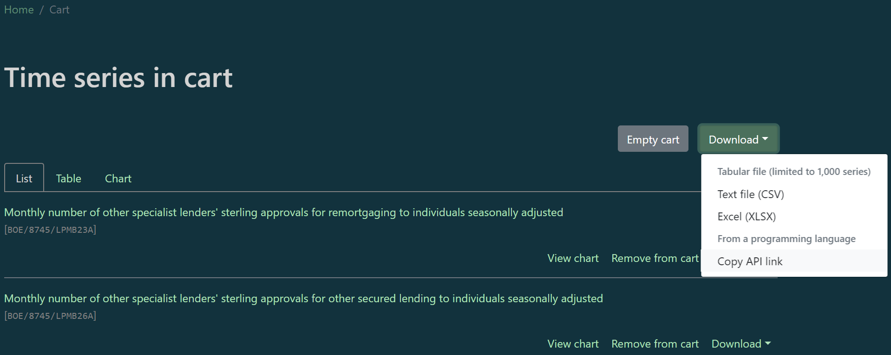

<style type="text/css">
h1.title {
  text-align: center;
  font-weight: bold;
}
h4.author { /* Header 4 - and the author and data headers use this too  */
  text-align: center;
}
h4.date { /* Header 4 - and the author and data headers use this too  */
  text-align: center;
}
</style>

# DBnomics: the world's economic database

You can explore all the economic data from different providers by following the link [db.nomics.world](https://db.nomics.world)  
(*N.B.: in the examples, data have already been retrieved on september 5<sup>th</sup> 2019*).

[](https://db.nomics.world)

# Fetch time series by `ids`

First, let's assume that we know which series we want to download. A series identifier (`ids`) is defined by three values, formatted like this: `provider_code`/`dataset_code`/`series_code`.

## Fetch one series from dataset 'Unemployment rate' (ZUTN) of AMECO provider

```{r, echo = FALSE}
library <- function(...) {
  suppressWarnings(
    suppressPackageStartupMessages(base::library(..., quietly = TRUE))
  )
}
```

```{r}
library(magrittr)
library(dplyr)
library(ggplot2)
library(rdbnomics)
```

```{r, echo = FALSE}
reorder_cols <- function(x) {
  cols <- c(
    "provider_code", "dataset_code", "dataset_name", "series_code",
    "series_name", "original_period", "period", "value", "@frequency"
  )

  if ("unit" %in% colnames(x)) {
    cols <- c(cols, "unit", "Unit")
  }

  if ("geo" %in% colnames(x)) {
    cols <- c(cols, "geo", "Country")
  }

  if ("freq" %in% colnames(x)) {
    cols <- c(cols, "freq", "Frequency")
  }

  cols_add <- setdiff(colnames(x), cols)
  cols <- c(cols, cols_add)

  cols <- cols[cols %in% colnames(x)]
  
  cols <- match(cols, colnames(x))

  dplyr::select(x, cols)
}

scale_colour_discrete <- function(...) {
  scale_color_brewer(palette = "Set1")
}

knitr::opts_chunk$set(dev.args = list(bg = "transparent"))

dbnomics <- function(legend_title = "Code") {
  list(
    scale_x_date(expand = c(0, 0)),
    xlab(""),
    ylab(""),
    guides(color = guide_legend(title = legend_title)),
    theme_bw(),
    theme(
      legend.position = "bottom", legend.direction = "vertical",
      legend.background = element_rect(fill = "transparent", colour = NA),
      legend.key = element_blank(),
      panel.background = element_rect(fill = "transparent", colour = NA),
      plot.background = element_rect(fill = "transparent", colour = NA),
      legend.title = element_blank()
    ),
    annotate(
      geom = "text", label = "DBnomics", 
      x = structure(Inf, class = "Date"), y = -Inf,
      hjust = 1.1, vjust = -0.4, col = "grey", 
      fontface = "italic"
    )
  )
}

display_table <- function(DT) {
  DT_ok <- FALSE
  if (
    "rmarkdown" %in% installed.packages()[, "Package"] &
    "DT" %in% installed.packages()[, "Package"]
  ) {
    if (rmarkdown::pandoc_available()) {
      if (rmarkdown::pandoc_version() >= numeric_version("1.12.3")) {
        DT_ok <- TRUE
      }
    }
  }

  if (DT_ok) {
    DT::datatable(
      DT,
      rownames = FALSE, options = list(pageLength = 5, scrollX = TRUE)
    )
  } else {
    dplyr::as.tbl(DT)
  }
}
```

```{r, eval = FALSE}
df <- rdb(ids = 'AMECO/ZUTN/EA19.1.0.0.0.ZUTN') %>%
  filter(!is.na(value))
```
```{r, eval = TRUE, echo = FALSE}
df <- rdbnomics:::rdbnomics_df001
```

In such data.frame (data.table or tibble), you will always find at least nine columns:

- `provider_code`
- `dataset_code`
- `dataset_name`
- `series_code`
- `series_name`
- `original_period` (character string)
- `period` (date of the first day of `original_period`)
- `value`
- `@frequency` (harmonized frequency generated by DBnomics)

The other columns depend on the provider and on the dataset. They always come in pairs (for the code and the name). In the data.frame `df`, you have:

- `unit` (code) and `Unit` (name)
- `geo` (code) and `Country` (name)
- `freq` (code) and `Frequency` (name)

```{r, echo = FALSE}
df %>%
  reorder_cols() %>%
  display_table()
```

```{r, fig.align = 'center'}
ggplot(df, aes(x = period, y = value, color = series_code)) +
  geom_line(size = 2) +
  dbnomics()
```

In the event that you only use the argument `ids`, you can drop it and run:
```{r, eval = FALSE}
df <- rdb('AMECO/ZUTN/EA19.1.0.0.0.ZUTN')
```

## Fetch two series from dataset 'Unemployment rate' (ZUTN) of AMECO provider

```{r, eval = FALSE}
df <- rdb(ids = c('AMECO/ZUTN/EA19.1.0.0.0.ZUTN', 'AMECO/ZUTN/DNK.1.0.0.0.ZUTN')) %>%
  filter(!is.na(value))
```
```{r, eval = TRUE, echo = FALSE}
df <- rdbnomics:::rdbnomics_df002
```

```{r, echo = FALSE}
df %>%
  arrange(series_code, period) %>%
  reorder_cols() %>%
  display_table()
```

```{r, fig.align = 'center'}
ggplot(df, aes(x = period, y = value, color = series_code)) +
  geom_line(size = 2) +
  dbnomics()
```

## Fetch two series from different datasets of different providers

```{r, eval = FALSE}
df <- rdb(ids = c('AMECO/ZUTN/EA19.1.0.0.0.ZUTN', 'Eurostat/une_rt_q/Q.SA.TOTAL.PC_ACT.T.EA19')) %>%
  filter(!is.na(value))
```
```{r, eval = TRUE, echo = FALSE}
df <- rdbnomics:::rdbnomics_df003
```

```{r, echo = FALSE}
df %>%
  arrange(series_code, period) %>%
  reorder_cols() %>%
  display_table()
```

```{r, fig.align = 'center'}
ggplot(df, aes(x = period, y = value, color = series_code)) +
  geom_line(size = 2) +
  dbnomics()
```

# Fetch time series by `mask`
The code mask notation is a very concise way to select one or many time series at once.

## Fetch one series from dataset 'Consumer Price Index' (CPI) of IMF
```{r, eval = FALSE}
df <- rdb('IMF', 'CPI', mask = 'M.DE.PCPIEC_WT') %>%
  filter(!is.na(value))
```
```{r, eval = TRUE, echo = FALSE}
df <- rdbnomics:::rdbnomics_df004
```

```{r, echo = FALSE}
df %>%
  reorder_cols() %>%
  display_table()
```

```{r, fig.align = 'center'}
ggplot(df, aes(x = period, y = value, color = series_code)) +
  geom_step(size = 2) +
  dbnomics()
```

In the event that you only use the arguments `provider_code`, `dataset_code` and `mask`, you can drop the name `mask` and run:
```{r, eval = FALSE}
df <- rdb('IMF', 'CPI', 'M.DE.PCPIEC_WT')
```

## Fetch two series from dataset 'Consumer Price Index' (CPI) of IMF

You just have to add a `+` between two different values of a dimension.
```{r, eval = FALSE}
df <- rdb('IMF', 'CPI', mask = 'M.DE+FR.PCPIEC_WT') %>%
  filter(!is.na(value))
```
```{r, eval = TRUE, echo = FALSE}
df <- rdbnomics:::rdbnomics_df005
```

```{r, echo = FALSE}
df %>%
  arrange(series_code, period) %>%
  reorder_cols() %>%
  display_table()
```

```{r, fig.align = 'center'}
ggplot(df, aes(x = period, y = value, color = series_code)) +
  geom_step(size = 2) +
  dbnomics()
```

## Fetch all series along one dimension from dataset 'Consumer Price Index' (CPI) of IMF

```{r, eval = FALSE}
df <- rdb('IMF', 'CPI', mask = 'M..PCPIEC_WT') %>%
  filter(!is.na(value)) %>%
  arrange(desc(period), REF_AREA) %>%
  head(100)
```
```{r, eval = TRUE, echo = FALSE}
df <- rdbnomics:::rdbnomics_df006
```

```{r, echo = FALSE}
df %>%
  reorder_cols() %>%
  display_table()
```

## Fetch series along multiple dimensions from dataset 'Consumer Price Index' (CPI) of IMF

```{r, eval = FALSE}
df <- rdb('IMF', 'CPI', mask = 'M..PCPIEC_IX+PCPIA_IX') %>%
  filter(!is.na(value)) %>%
  group_by(INDICATOR) %>%
  top_n(n = 50, wt = period)
```
```{r, eval = TRUE, echo = FALSE}
df <- ungroup(rdbnomics:::rdbnomics_df007)
```

```{r, echo = FALSE}
df %>%
  reorder_cols() %>%
  display_table()
```

# Fetch time series by `dimensions`
Searching by `dimensions` is a less concise way to select time series than using the code `mask`, but it works with all the different providers. You have a "*Description of series code*" at the bottom of each dataset page on the [DBnomics website](https://db.nomics.world).

## Fetch one value of one dimension from dataset 'Unemployment rate' (ZUTN) of AMECO provider

```{r, eval = FALSE}
df <- rdb('AMECO', 'ZUTN', dimensions = list(geo = "ea19")) %>%
  filter(!is.na(value))
# or
# df <- rdb('AMECO', 'ZUTN', dimensions = '{"geo": ["ea19"]}') %>%
#   filter(!is.na(value))
```
```{r, eval = TRUE, echo = FALSE}
df <- rdbnomics:::rdbnomics_df008
```

```{r, echo = FALSE}
df %>%
  reorder_cols() %>%
  display_table()
```

```{r, fig.align = 'center'}
ggplot(df, aes(x = period, y = value, color = series_code)) +
  geom_line(size = 2) +
  dbnomics()
```

## Fetch two values of one dimension from dataset 'Unemployment rate' (ZUTN) of AMECO provider

```{r, eval = FALSE}
df <- rdb('AMECO', 'ZUTN', dimensions = list(geo = c("ea19", "dnk"))) %>%
  filter(!is.na(value))
# or
# df <- rdb('AMECO', 'ZUTN', dimensions = '{"geo": ["ea19", "dnk"]}') %>%
#   filter(!is.na(value))
```
```{r, eval = TRUE, echo = FALSE}
df <- rdbnomics:::rdbnomics_df009
```

```{r, echo = FALSE}
df %>%
  arrange(series_code, period) %>%
  reorder_cols() %>%
  display_table()
```

```{r, fig.align = 'center'}
ggplot(df, aes(x = period, y = value, color = series_code)) +
  geom_line(size = 2) +
  dbnomics()
```

## Fetch several values of several dimensions from dataset 'Doing business' (DB) of World Bank

```{r, eval = FALSE}
df <- rdb('WB', 'DB', dimensions = list(country = c("DZ", "PE"), indicator = c("ENF.CONT.COEN.COST.ZS", "IC.REG.COST.PC.FE.ZS"))) %>%
  filter(!is.na(value))
# or
# df <- rdb('WB', 'DB', dimensions = '{"country": ["DZ", "PE"], "indicator": ["ENF.CONT.COEN.COST.ZS", "IC.REG.COST.PC.FE.ZS"]}') %>%
#   filter(!is.na(value))
```
```{r, eval = TRUE, echo = FALSE}
df <- rdbnomics:::rdbnomics_df010
```

```{r, echo = FALSE}
df %>%
  arrange(series_name, period) %>%
  reorder_cols() %>%
  display_table()
```

```{r, fig.align = 'center'}
ggplot(df, aes(x = period, y = value, color = series_name)) +
  geom_line(size = 2) +
  dbnomics()
```

# Fetch time series found on the web site

When you don't know the codes of the dimensions, provider, dataset or series, you can:

- go to the page of a dataset on [DBnomics website](https://db.nomics.world), for example [Doing Business](https://db.nomics.world/WB/DB),  

- select some dimensions by using the input widgets of the left column,
  

- click on "*Copy API link*" in the menu of the "*Download*" button,
  

- use the `rdb_by_api_link` function such as below.  

```{r, eval = FALSE}
df <- rdb_by_api_link("https://api.db.nomics.world/v22/series/WB/DB?dimensions=%7B%22country%22%3A%5B%22FR%22%2C%22IT%22%2C%22ES%22%5D%7D&q=IC.REG.PROC.FE.NO&observations=1&format=json&align_periods=1&offset=0&facets=0") %>%
  filter(!is.na(value))
```
```{r, eval = TRUE, echo = FALSE}
df <- rdbnomics:::rdbnomics_df011
```

```{r, echo = FALSE}
df %>%
  arrange(period, series_name) %>%
  reorder_cols() %>%
  display_table()
```

```{r, fig.align = 'center'}
ggplot(df, aes(x = period, y = value, color = series_name)) +
  geom_step(size = 2) +
  dbnomics()
```

# Fetch time series from the cart

On the cart page of the [DBnomics website](https://db.nomics.world), click on "*Copy API link*" and copy-paste it as an argument of the `rdb_by_api_link` function. Please note that when you update your cart, you have to copy this link again, because the link itself contains the ids of the series in the cart.
<center>

</center>
  
```{r, eval = FALSE}
df <- rdb_by_api_link("https://api.db.nomics.world/v22/series?series_ids=BOE%2F8745%2FLPMB23A%2CBOE%2F8745%2FLPMB26A&observations=1&format=json&align_periods=1") %>%
  filter(!is.na(value))
```
```{r, eval = TRUE, echo = FALSE}
df <- rdbnomics:::rdbnomics_df012
```

```{r, echo = FALSE}
df %<>%
  mutate(
    series_name = sapply(
      series_name,
      function(y) {
        paste0(
          paste0(
            strsplit(y, "approvals ")[[1]], collapse = "approvals\n"
          ),
          "\n"
        )
      }
    )
  )
```

```{r, echo = FALSE}
df %>%
  arrange(period, series_name) %>%
  reorder_cols() %>%
  display_table()
```

```{r, fig.align = 'center'}
ggplot(df, aes(x = period, y = value, color = series_name)) +
  geom_line(size = 2) +
  scale_y_continuous(labels = function(x) { format(x, big.mark = " ") }) +
  dbnomics()
```

# Proxy configuration or connection error `Could not resolve host`

When using the functions `rdb` or `rdb_...`, you may come across the following error:
```{r, eval = FALSE}
Error in open.connection(con, "rb") :
  Could not resolve host: api.db.nomics.world
```

To get round this situation, you have two options:

1. configure **curl** to use a specific and authorized proxy.

2. use the default R internet connection i.e. the Internet Explorer proxy defined in *internet2.dll*.

## Configure **curl** to use a specific and authorized proxy

In **rdbnomics**, by default the function `curl_fetch_memory` (of the package **curl**) is used to fetch the data. If a specific proxy must be used, it is possible to define it permanently with the package option `rdbnomics.curl_config` or on the fly through the argument `curl_config`. In that way:

- if the object is of class `curl_handle` then it is passed to the argument `handle` of the `curl_fetch_memory` function,
- if the object is a named list then the elements are passed to the connection (the `curl_handle` object created internally with `new_handle()`) with `handle_setopt()` before using `curl_fetch_memory`.

To see the available parameters, run `names(curl_options())` in *R* or visit the website <a href="https://curl.haxx.se/libcurl/c/curl_easy_setopt.html" target="_blank">https://curl.haxx.se/libcurl/c/curl_easy_setopt.html</a>. Once they are chosen, you define the curl object as follows:
```{r, eval = FALSE}
h <- list(
  proxy = "<proxy>",
  proxyport = <port>,
  proxyusername = "<username>",
  proxypassword = "<password>"
)
```

### Set the connection up for a session

The curl connection can be set up for a session by modifying the following package option:
```{r, eval = FALSE}
options(rdbnomics.curl_config = h)
```
When fetching the data, the following command is executed:
```{r, eval = FALSE}
hndl <- curl::new_handle()
curl::handle_setopt(hndl, .list = getOption("rdbnomics.curl_config"))
curl::curl_fetch_memory(url = <...>, handle = hndl)
```

After configuration, just use the standard functions of **rdbnomics** e.g.:
```{r, eval = FALSE}
df1 <- rdb(ids = 'AMECO/ZUTN/EA19.1.0.0.0.ZUTN')
```
This option of the package can be disabled with:
```{r, eval = FALSE}
options(rdbnomics.curl = NULL)
```

### Use the connection only for a function call

If a complete configuration is not needed but just an "on the fly" execution, then use the argument `curl_config` of the functions `rdb` and `rdb_...`:
```{r, eval = FALSE}
df1 <- rdb(ids = 'AMECO/ZUTN/EA19.1.0.0.0.ZUTN', curl_config = h)
```

## Use the default R internet connection

To retrieve the data with the default R internet connection, **rdbnomics** will use the base function `readLines`.

### Set the connection up for a session

To activate this feature for a session, you need to enable an option of the package:
```{r, eval = FALSE}
options(rdbnomics.use_readLines = TRUE)
```
And then use the standard function as follows:
```{r, eval = FALSE}
df1 <- rdb(ids = 'AMECO/ZUTN/EA19.1.0.0.0.ZUTN')
```
This configuration can be disabled with:
```{r, eval = FALSE}
options(rdbnomics.use_readLines = FALSE)
```

### Use the connection only for a function call

If you just want to do it once, you may use the argument `use_readLines` of the functions `rdb` and `rdb_...`:
```{r, eval = FALSE}
df1 <- rdb(ids = 'AMECO/ZUTN/EA19.1.0.0.0.ZUTN', use_readLines = TRUE)
```

# Transform time series with filters
The **rdbnomics** package can interact with the *Time Series Editor* of DBnomics to transform time series by applying filters to them.  
Available filters are listed on the filters page [https://editor.nomics.world/filters](https://editor.nomics.world/filters).
The *Time Series Editor* is usable via the web interface but you can call it directly from *R*.  

Here is an example of how to proceed to interpolate two annual time series with a monthly frequency, using a spline interpolation:

```{r, eval = FALSE}
filters <- list(
  code = "interpolate",
  parameters = list(frequency = "monthly", method = "spline")
)
```
The request is then:
```{r, eval = FALSE}
df <- rdb(
  ids = c("AMECO/ZUTN/EA19.1.0.0.0.ZUTN", "AMECO/ZUTN/DNK.1.0.0.0.ZUTN"),
  filters = filters
)
```

If you want to apply more than one filter, the `filters` argument will be a list of valid filters:

```{r, eval = FALSE}
filters <- list(
  list(
    code = "interpolate",
    parameters = list(frequency = "monthly", method = "spline")
  ),
  list(
    code = "aggregate",
    parameters = list(frequency = "bi-annual", method = "end_of_period")
  )
)

df <- rdb(
  ids = c("AMECO/ZUTN/EA19.1.0.0.0.ZUTN", "AMECO/ZUTN/DNK.1.0.0.0.ZUTN"),
  filters = filters
)
```

The `data.table` columns change a little bit when filters are used. There are two new columns:

- `period_middle_day`: the middle day of `original_period` (can be useful when you compare graphically interpolated series and original ones).
- `filtered` (boolean): `TRUE` if the series is filtered, `FALSE` otherwise.

The content of two columns are modified:

- `series_code`: same as before for original series, but the suffix `_filtered` is added for filtered series.
- `series_name`: same as before for original series, but the suffix ` (filtered)` is added for filtered series.

```{r, eval = TRUE, echo = FALSE}
df <- rdbnomics:::rdbnomics_df013
```

```{r, echo = FALSE}
df %>%
  arrange(filtered, series_name, period) %>%
  reorder_cols() %>%
  display_table()
```

```{r, fig.align = 'center'}
ggplot(filter(df, !is.na(value)), aes(x = period, y = value, color = series_name)) +
  geom_line(size = 1) +
  dbnomics()
```

# Appendix

## ggplot2 function `dbnomics()` used in the vignette

We show the function `dbnomics()` as an information. It's not implemented in the
package.

```{r, eval = FALSE}
dbnomics <- function(legend_title = "Code") {
  list(
    scale_x_date(expand = c(0, 0)),
    xlab(""),
    ylab(""),
    guides(color = guide_legend(title = legend_title)),
    theme_bw(),
    theme(
      legend.position = "bottom", legend.direction = "vertical",
      legend.background = element_rect(fill = "transparent", colour = NA),
      legend.key = element_blank(),
      panel.background = element_rect(fill = "transparent", colour = NA),
      plot.background = element_rect(fill = "transparent", colour = NA),
      legend.title = element_blank()
    ),
    annotate(
      geom = "text", label = "DBnomics", 
      x = structure(Inf, class = "Date"), y = -Inf,
      hjust = 1.1, vjust = -0.4, col = "grey", 
      fontface = "italic"
    )
  )
}
```
