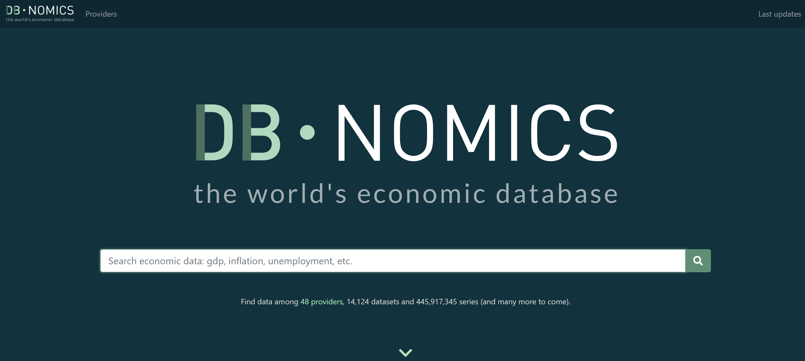

<style type="text/css">
h1.title {
  text-align: center;
  font-weight: bold;
}
h4.author { /* Header 4 - and the author and data headers use this too  */
  text-align: center;
}
h4.date { /* Header 4 - and the author and data headers use this too  */
  text-align: center;
}
</style>

# DBnomics: the world's economic database

Explore all the economic data from different providers (national and international statistical institutes, central banks, etc.), for free, following the link [db.nomics.world](https://db.nomics.world)  
(*N.B.: in the examples, data have already been retrieved on april 6<sup>th</sup> 2020*).

[](https://db.nomics.world)

# Fetch time series by `ids`

First, let's assume that we know which series we want to download. A series identifier (`ids`) is defined by three values, formatted like this: `provider_code`/`dataset_code`/`series_code`.

## Fetch one series from dataset 'Unemployment rate' (ZUTN) of AMECO provider

```{r, echo = FALSE}
library <- function(...) {
  suppressWarnings(
    suppressPackageStartupMessages(base::library(..., quietly = TRUE))
  )
}
```

```{r}
library(data.table)
library(rdbnomics)
```

```{r, echo = FALSE}
reorder_cols <- function(x) {
  data.table::setDT(x)

  cols <- c(
    "provider_code", "dataset_code", "dataset_name", "series_code",
    "series_name", "original_period", "period", "original_value", "value",
    "@frequency"
  )

  if ("unit" %in% colnames(x)) {
    cols <- c(cols, "unit", "Unit")
  }

  if ("geo" %in% colnames(x)) {
    cols <- c(cols, "geo", "Country")
  }

  if ("freq" %in% colnames(x)) {
    cols <- c(cols, "freq", "Frequency")
  }

  cols_add <- setdiff(colnames(x), cols)
  cols <- c(cols, cols_add)

  cols <- cols[cols %in% colnames(x)]
  
  cols <- match(cols, colnames(x))

  x[, .SD, .SDcols = cols]
}

knitr::opts_chunk$set(dev.args = list(bg = "transparent"))

display_table <- function(DT) {
  DT <- head(DT)
  DT <- as.data.table(
    lapply(DT, function(x) {
      if (is.character(x)) {
        ifelse(
          nchar(x) > 16,
          paste0(substr(x, 1, 16), "..."),
          x
        )
      } else {
        x
      }
    })
  )
  DT[]
}
```

```{r, eval = FALSE}
df <- rdb(ids = "AMECO/ZUTN/EA19.1.0.0.0.ZUTN")
df <- df[!is.na(value)]
```
```{r, eval = TRUE, echo = FALSE}
df <- rdbnomics:::rdbnomics_df001
data.table::setDT(df)
```

In such `data.table`, you will always find at least ten columns:

- `provider_code`
- `dataset_code`
- `dataset_name`
- `series_code`
- `series_name`
- `original_period` (character string)
- `period` (date of the first day of `original_period`)
- `original_value` (character string)
- `value`
- `@frequency` (harmonized frequency generated by DBnomics)

The other columns depend on the provider and on the dataset. They always come in pairs (for the code and the name). In the data.frame `df`, you have:

- `unit` (code) and `Unit` (name)
- `geo` (code) and `Country` (name)
- `freq` (code) and `Frequency` (name)

```{r, echo = FALSE}
df <- reorder_cols(df)
display_table(df)
```

```{r, echo = FALSE, fig.align = 'center'}
# ggplot(df, aes(x = period, y = value, color = series_name)) +
#   geom_line(size = 1.2) +
#   geom_point(size = 2) +
#   dbnomics()
i <- 1
x1 <- df[series_name == sort(unique(series_name))[i]]$period
y1 <- df[series_name == sort(unique(series_name))[i]]$value
cols <- c("red", "blue", "darkgreen")
PCH <- 18

plot(
  x1, y1, col = cols[1], type = "l", xlab = "", ylab = "",
  xlim = c(min(df$period), max(df$period)),
  ylim = c(min(df$value) - 0.5, max(df$value)),
  panel.first = grid(lty = 1)
)
points(x1, y1, col = cols[1], pch = PCH)
legend(
  "bottomleft", inset = 0.005,
  legend = sort(unique(df$series_name)),
  col = cols,
  lty = 1, pch = PCH,  box.lty = 0, cex = 0.7
)
mtext(
  text = "DBnomics <https://db.nomics.world>",
  side = 3, col = "grey", font = 3, adj = 1
)
```

In the event that you only use the argument `ids`, you can drop it and run:
```{r, eval = FALSE}
df <- rdb("AMECO/ZUTN/EA19.1.0.0.0.ZUTN")
```

## Fetch two series from dataset 'Unemployment rate' (ZUTN) of AMECO provider

```{r, eval = FALSE}
df <- rdb(ids = c("AMECO/ZUTN/EA19.1.0.0.0.ZUTN", "AMECO/ZUTN/DNK.1.0.0.0.ZUTN"))
df <- df[!is.na(value)]
```
```{r, eval = TRUE, echo = FALSE}
df <- rdbnomics:::rdbnomics_df002
data.table::setDT(df)
```

```{r, echo = FALSE}
df <- df[order(series_code, period)]
df <- reorder_cols(df)
display_table(df)
```

```{r, echo = FALSE, fig.align = 'center'}
# ggplot(df, aes(x = period, y = value, color = series_name)) +
#   geom_line(size = 1.2) +
#   geom_point(size = 2) +
#   dbnomics()
i <- 1
x1 <- df[series_name == sort(unique(series_name))[i]]$period
y1 <- df[series_name == sort(unique(series_name))[i]]$value
i <- 2
x2 <- df[series_name == sort(unique(series_name))[i]]$period
y2 <- df[series_name == sort(unique(series_name))[i]]$value
cols <- c("red", "blue", "darkgreen")
PCH <- 18

plot(
  x1, y1, col = cols[1], type = "l", xlab = "", ylab = "",
  xlim = c(min(df$period), max(df$period)),
  ylim = c(min(df$value) - 1.7, max(df$value)),
  panel.first = grid(lty = 1)
)
points(x1, y1, col = cols[1], pch = PCH)
lines(x2, y2, col = cols[2], type = "l")
points(x2, y2, col = cols[2], pch = PCH)
legend(
  "bottomleft", inset = 0.005,
  legend = sort(unique(df$series_name)),
  col = cols,
  lty = 1, pch = PCH,  box.lty = 0, cex = 0.7
)
mtext(
  text = "DBnomics <https://db.nomics.world>",
  side = 3, col = "grey", font = 3, adj = 1
)
```

## Fetch two series from different datasets of different providers

```{r, eval = FALSE}
df <- rdb(ids = c("AMECO/ZUTN/EA19.1.0.0.0.ZUTN", "Eurostat/une_rt_q/Q.SA.Y15-24.PC_ACT.T.EA19"))
df <- df[!is.na(value)]
```
```{r, eval = TRUE, echo = FALSE}
df <- rdbnomics:::rdbnomics_df003
data.table::setDT(df)
```

```{r, echo = FALSE}
df <- df[order(series_code, period)]
df <- reorder_cols(df)
display_table(df)
```

```{r, echo = FALSE, fig.align = 'center'}
# ggplot(df, aes(x = period, y = value, color = series_name)) +
#   geom_line(size = 1.2) +
#   geom_point(size = 2) +
#   dbnomics(legend.text = element_text(size = 7))
i <- 1
x1 <- df[series_name == sort(unique(series_name))[i]]$period
y1 <- df[series_name == sort(unique(series_name))[i]]$value
i <- 2
x2 <- df[series_name == sort(unique(series_name))[i]]$period
y2 <- df[series_name == sort(unique(series_name))[i]]$value
cols <- c("red", "blue", "darkgreen")
PCH <- 18
legend_text <- sort(unique(df$series_name))
legend_text[2] <- sapply(
  legend_text[2],
  function(y) {
    paste0(
      paste0(
        strsplit(y, "active ")[[1]], collapse = "active\n"
      ),
      "\n"
    )
  }
)

plot(
  x1, y1, col = cols[1], type = "l", xlab = "", ylab = "",
  xlim = c(min(df$period), max(df$period)),
  ylim = c(min(df$value) - 1.5, max(df$value)),
  panel.first = grid(lty = 1)
)
points(x1, y1, col = cols[1], pch = PCH)
lines(x2, y2, col = cols[2], type = "l")
points(x2, y2, col = cols[2], pch = PCH)
legend(
  "bottomleft", inset = 0.005,
  legend = legend_text,
  col = cols,
  lty = 1, pch = PCH,  box.lty = 0, cex = 0.7
)
mtext(
  text = "DBnomics <https://db.nomics.world>",
  side = 3, col = "grey", font = 3, adj = 1
)
```

# Fetch time series by `mask`
The code mask notation is a very concise way to select one or many time series at once.

## Fetch one series from dataset 'Balance of Payments' (BOP) of IMF
```{r, eval = FALSE}
df <- rdb("IMF", "BOP", mask = "A.FR.BCA_BP6_EUR")
df <- df[!is.na(value)]
```
```{r, eval = TRUE, echo = FALSE}
df <- rdbnomics:::rdbnomics_df004
data.table::setDT(df)
```

```{r, echo = FALSE}
df <- reorder_cols(df)
display_table(df)
```

```{r, echo = FALSE, fig.align = 'center'}
# ggplot(df, aes(x = period, y = value, color = series_name)) +
#   geom_step(size = 1.2) +
#   geom_point(size = 2) +
#   dbnomics()
i <- 1
x1 <- df[series_name == sort(unique(series_name))[i]]$period
y1 <- df[series_name == sort(unique(series_name))[i]]$value
cols <- c("red", "blue", "darkgreen")
PCH <- 18
legend_text <- sort(unique(df$series_name))

plot(
  x1, y1, col = cols[1], type = "s", xlab = "", ylab = "",
  xlim = c(min(df$period), max(df$period)),
  ylim = c(min(df$value), max(df$value)),
  panel.first = grid(lty = 1)
)
points(x1, y1, col = cols[1], pch = PCH)
legend(
  "bottomleft", inset = 0.005,
  legend = legend_text,
  col = cols,
  lty = 1, pch = PCH,  box.lty = 0, cex = 0.7
)
mtext(
  text = "DBnomics <https://db.nomics.world>",
  side = 3, col = "grey", font = 3, adj = 1
)
```

In the event that you only use the arguments `provider_code`, `dataset_code` and `mask`, you can drop the name `mask` and run:
```{r, eval = FALSE}
df <- rdb("IMF", "BOP", "A.FR.BCA_BP6_EUR")
```

## Fetch two series from dataset 'Balance of Payments' (BOP) of IMF

You just have to add a `+` between two different values of a dimension.
```{r, eval = FALSE}
df <- rdb("IMF", "BOP", mask = "A.FR+ES.BCA_BP6_EUR")
df <- df[!is.na(value)]
```
```{r, eval = TRUE, echo = FALSE}
df <- rdbnomics:::rdbnomics_df005
data.table::setDT(df)
```

```{r, echo = FALSE}
df <- df[order(series_code, period)]
df <- reorder_cols(df)
display_table(df)
```

```{r, echo = FALSE, fig.align = 'center'}
# ggplot(df, aes(x = period, y = value, color = series_name)) +
#   geom_step(size = 1.2) +
#   geom_point(size = 2) +
#   dbnomics()
i <- 1
x1 <- df[series_name == sort(unique(series_name))[i]]$period
y1 <- df[series_name == sort(unique(series_name))[i]]$value
i <- 2
x2 <- df[series_name == sort(unique(series_name))[i]]$period
y2 <- df[series_name == sort(unique(series_name))[i]]$value
cols <- c("red", "blue", "darkgreen")
PCH <- 18
legend_text <- sort(unique(df$series_name))

plot(
  x1, y1, col = cols[1], type = "s", xlab = "", ylab = "",
  xlim = c(min(df$period), max(df$period)),
  ylim = c(min(df$value) - 2*10^4, max(df$value)),
  panel.first = grid(lty = 1)
)
points(x1, y1, col = cols[1], pch = PCH)
lines(x2, y2, col = cols[2], type = "s")
points(x2, y2, col = cols[2], pch = PCH)
legend(
  "bottomleft", inset = 0.005,
  legend = legend_text,
  col = cols,
  lty = 1, pch = PCH,  box.lty = 0, cex = 0.7
)
mtext(
  text = "DBnomics <https://db.nomics.world>",
  side = 3, col = "grey", font = 3, adj = 1
)
```

## Fetch all series along one dimension from dataset 'Balance of Payments' (BOP) of IMF

```{r, eval = FALSE}
df <- rdb("IMF", "BOP", mask = "A..BCA_BP6_EUR")
df <- df[!is.na(value)]
df <- df[order(-period, REF_AREA)]
df <- head(df, 100)
```
```{r, eval = TRUE, echo = FALSE}
df <- rdbnomics:::rdbnomics_df006
data.table::setDT(df)
```

```{r, echo = FALSE}
df <- reorder_cols(df)
display_table(df)
```

## Fetch series along multiple dimensions from dataset 'Balance of Payments' (BOP) of IMF

```{r, eval = FALSE}
df <- rdb("IMF", "BOP", mask = "A.FR.BCA_BP6_EUR+IA_BP6_EUR")
df <- df[!is.na(value)]
df <- df[order(period), head(.SD, 50), by = INDICATOR]
```
```{r, eval = TRUE, echo = FALSE}
df <- rdbnomics:::rdbnomics_df007
data.table::setDT(df)
```

```{r, echo = FALSE}
df <- reorder_cols(df)
display_table(df)
```

# Fetch time series by `dimensions`
Searching by `dimensions` is a less concise way to select time series than using the code `mask`, but it works with all the different providers. You have a "*Description of series code*" at the bottom of each dataset page on the [DBnomics website](https://db.nomics.world).

## Fetch one value of one dimension from dataset 'Unemployment rate' (ZUTN) of AMECO provider

```{r, eval = FALSE}
df <- rdb("AMECO", "ZUTN", dimensions = list(geo = "ea19"))
df <- df[!is.na(value))]
# or
# df <- rdb("AMECO", "ZUTN", dimensions = '{"geo": ["ea19"]}')
# df <- df[!is.na(value))]
```
```{r, eval = TRUE, echo = FALSE}
df <- rdbnomics:::rdbnomics_df008
data.table::setDT(df)
```

```{r, echo = FALSE}
df <- reorder_cols(df)
display_table(df)
```

```{r, echo = FALSE, fig.align = 'center'}
# ggplot(df, aes(x = period, y = value, color = series_name)) +
#   geom_line(size = 1.2) +
#   geom_point(size = 2) +
#   dbnomics()
i <- 1
x1 <- df[series_name == sort(unique(series_name))[i]]$period
y1 <- df[series_name == sort(unique(series_name))[i]]$value
cols <- c("red", "blue", "darkgreen")
PCH <- 18
legend_text <- sort(unique(df$series_name))

plot(
  x1, y1, col = cols[1], type = "l", xlab = "", ylab = "",
  xlim = c(min(df$period), max(df$period)),
  ylim = c(min(df$value) - 0.2, max(df$value)),
  panel.first = grid(lty = 1)
)
points(x1, y1, col = cols[1], pch = PCH)
legend(
  "bottomleft", inset = 0.005,
  legend = legend_text,
  col = cols,
  lty = 1, pch = PCH,  box.lty = 0, cex = 0.7
)
mtext(
  text = "DBnomics <https://db.nomics.world>",
  side = 3, col = "grey", font = 3, adj = 1
)
```

## Fetch two values of one dimension from dataset 'Unemployment rate' (ZUTN) of AMECO provider

```{r, eval = FALSE}
df <- rdb("AMECO", "ZUTN", dimensions = list(geo = c("ea19", "dnk")))
df <- df[!is.na(value))]
# or
# df <- rdb("AMECO", "ZUTN", dimensions = '{"geo": ["ea19", "dnk"]}')
# df <- df[!is.na(value))]
```
```{r, eval = TRUE, echo = FALSE}
df <- rdbnomics:::rdbnomics_df009
data.table::setDT(df)
```

```{r, echo = FALSE}
df <- df[order(series_code, period)]
df <- reorder_cols(df)
display_table(df)
```

```{r, echo = FALSE, fig.align = 'center'}
# ggplot(df, aes(x = period, y = value, color = series_name)) +
#   geom_line(size = 1.2) +
#   geom_point(size = 2) +
#   dbnomics()
i <- 1
x1 <- df[series_name == sort(unique(series_name))[i]]$period
y1 <- df[series_name == sort(unique(series_name))[i]]$value
i <- 2
x2 <- df[series_name == sort(unique(series_name))[i]]$period
y2 <- df[series_name == sort(unique(series_name))[i]]$value
cols <- c("red", "blue", "darkgreen")
PCH <- 18
legend_text <- sort(unique(df$series_name))

plot(
  x1, y1, col = cols[1], type = "l", xlab = "", ylab = "",
  xlim = c(min(df$period), max(df$period)),
  ylim = c(min(df$value) - 1.2, max(df$value)),
  panel.first = grid(lty = 1)
)
points(x1, y1, col = cols[1], pch = PCH)
lines(x2, y2, col = cols[2], type = "l")
points(x2, y2, col = cols[2], pch = PCH)
legend(
  "bottomleft", inset = 0.005,
  legend = legend_text,
  col = cols,
  lty = 1, pch = PCH,  box.lty = 0, cex = 0.7
)
mtext(
  text = "DBnomics <https://db.nomics.world>",
  side = 3, col = "grey", font = 3, adj = 1
)
```

## Fetch several values of several dimensions from dataset 'Doing business' (DB) of World Bank

```{r, eval = FALSE}
df <- rdb("WB", "DB", dimensions = list(country = c("DZ", "PE"), indicator = c("ENF.CONT.COEN.COST.ZS", "IC.REG.COST.PC.FE.ZS")))
df <- df[!is.na(value))]
# or
# df <- rdb("WB", "DB", dimensions = '{"country": ["DZ", "PE"], "indicator": ["ENF.CONT.COEN.COST.ZS", "IC.REG.COST.PC.FE.ZS"]}')
# df <- df[!is.na(value))]
```
```{r, eval = TRUE, echo = FALSE}
df <- rdbnomics:::rdbnomics_df010
data.table::setDT(df)
```

```{r, echo = FALSE}
df <- df[order(series_name, period)]
df <- reorder_cols(df)
display_table(df)
```

```{r, echo = FALSE, fig.align = 'center'}
# ggplot(df, aes(x = period, y = value, color = series_name)) +
#   geom_line(size = 1.2) +
#   geom_point(size = 2) +
#   dbnomics()
i <- 1
x1 <- df[series_name == sort(unique(series_name))[i]]$period
y1 <- df[series_name == sort(unique(series_name))[i]]$value
i <- 2
x2 <- df[series_name == sort(unique(series_name))[i]]$period
y2 <- df[series_name == sort(unique(series_name))[i]]$value
i <- 3
x3 <- df[series_name == sort(unique(series_name))[i]]$period
y3 <- df[series_name == sort(unique(series_name))[i]]$value
i <- 4
x4 <- df[series_name == sort(unique(series_name))[i]]$period
y4 <- df[series_name == sort(unique(series_name))[i]]$value
cols <- c("red", "blue", "darkgreen", "purple")
PCH <- 18
legend_text <- sort(unique(df$series_name))

plot(
  x1, y1, col = cols[1], type = "l", xlab = "", ylab = "",
  xlim = c(min(df$period), max(df$period)),
  ylim = c(min(df$value) - 7, max(df$value)),
  panel.first = grid(lty = 1)
)
points(x1, y1, col = cols[1], pch = PCH)
lines(x2, y2, col = cols[2], type = "l")
points(x2, y2, col = cols[2], pch = PCH)
lines(x3, y3, col = cols[3], type = "l")
points(x3, y3, col = cols[3], pch = PCH)
lines(x4, y4, col = cols[4], type = "l")
points(x4, y4, col = cols[4], pch = PCH)
legend(
  "bottomleft", inset = 0.005,
  legend = legend_text,
  col = cols,
  lty = 1, pch = PCH,  box.lty = 0, cex = 0.7
)
mtext(
  text = "DBnomics <https://db.nomics.world>",
  side = 3, col = "grey", font = 3, adj = 1
)
```

# Fetch time series with a `query`
The query is a Google-like search that will filter/select time series from a provider's dataset.

## Fetch one series from dataset 'WEO by countries' (WEO) of IMF
```{r, eval = FALSE}
df <- rdb("IMF", "WEO", query = "France current account balance percent")
df <- df[!is.na(value))]
```
```{r, eval = TRUE, echo = FALSE}
df <- rdbnomics:::rdbnomics_df014
data.table::setDT(df)
```

```{r, echo = FALSE}
df <- reorder_cols(df)
display_table(df)
```

```{r, echo = FALSE, fig.align = 'center'}
# ggplot(df, aes(x = period, y = value, color = series_name)) +
#   geom_line(size = 1.2) +
#   geom_point(size = 2) +
#   dbnomics()
i <- 1
x1 <- df[series_name == sort(unique(series_name))[i]]$period
y1 <- df[series_name == sort(unique(series_name))[i]]$value
cols <- c("red", "blue", "darkgreen", "purple")
PCH <- 18
legend_text <- sort(unique(df$series_name))

plot(
  x1, y1, col = cols[1], type = "l", xlab = "", ylab = "",
  xlim = c(min(df$period), max(df$period)),
  ylim = c(min(df$value) - 0.5, max(df$value)),
  panel.first = grid(lty = 1)
)
points(x1, y1, col = cols[1], pch = PCH)
legend(
  "bottomleft", inset = 0.005,
  legend = legend_text,
  col = cols,
  lty = 1, pch = PCH,  box.lty = 0, cex = 0.7
)
mtext(
  text = "DBnomics <https://db.nomics.world>",
  side = 3, col = "grey", font = 3, adj = 1
)
```

## Fetch series from dataset 'WEO by countries' (WEO) of IMF
```{r, eval = FALSE}
df <- rdb("IMF", "WEO", query = "current account balance percent")
df <- df[!is.na(value))]
```
```{r, eval = TRUE, echo = FALSE}
df <- rdbnomics:::rdbnomics_df015
data.table::setDT(df)
```

```{r, echo = FALSE}
df <- reorder_cols(df)
display_table(df)
```

```{r, echo = FALSE, fig.align = 'center'}
# ggplot(df, aes(x = period, y = value, color = `WEO Country`)) +
#   geom_line(size = 1.2) +
#   geom_point(size = 2) +
#   ggtitle("Current account balance (% GDP)") +
#   dbnomics(legend.direction = "horizontal")
i <- 1
x1 <- df[series_name == sort(unique(series_name))[i]]$period
y1 <- df[series_name == sort(unique(series_name))[i]]$value
i <- 2
x2 <- df[series_name == sort(unique(series_name))[i]]$period
y2 <- df[series_name == sort(unique(series_name))[i]]$value
i <- 3
x3 <- df[series_name == sort(unique(series_name))[i]]$period
y3 <- df[series_name == sort(unique(series_name))[i]]$value
i <- 4
x4 <- df[series_name == sort(unique(series_name))[i]]$period
y4 <- df[series_name == sort(unique(series_name))[i]]$value
cols <- c("red", "blue", "darkgreen", "purple")
PCH <- 18
legend_text <- sort(unique(df$series_name))

plot(
  x1, y1, col = cols[1], type = "l", xlab = "", ylab = "",
  xlim = c(min(df$period), max(df$period)),
  ylim = c(min(df$value), max(df$value)),
  panel.first = grid(lty = 1)
)
points(x1, y1, col = cols[1], pch = PCH)
lines(x2, y2, col = cols[2], type = "l")
points(x2, y2, col = cols[2], pch = PCH)
lines(x3, y3, col = cols[3], type = "l")
points(x3, y3, col = cols[3], pch = PCH)
lines(x4, y4, col = cols[4], type = "l")
points(x4, y4, col = cols[4], pch = PCH)
legend(
  "bottomleft", inset = 0.005,
  legend = legend_text,
  col = cols,
  lty = 1, pch = PCH,  box.lty = 0, cex = 0.7
)
mtext(
  text = "DBnomics <https://db.nomics.world>",
  side = 3, col = "grey", font = 3, adj = 1
)
```

# Fetch time series found on the web site

When you don't know the codes of the dimensions, provider, dataset or series, you can:

- go to the page of a dataset on [DBnomics website](https://db.nomics.world), for example [Doing Business](https://db.nomics.world/WB/DB),  

- select some dimensions by using the input widgets of the left column,
  

- click on "*Copy API link*" in the menu of the "*Download*" button,
  

- use the `rdb(api_link = ...)` function such as below.  

```{r, eval = FALSE}
df <- rdb(api_link = "https://api.db.nomics.world/v22/series/WB/DB?dimensions=%7B%22country%22%3A%5B%22FR%22%2C%22IT%22%2C%22ES%22%5D%7D&q=IC.REG.PROC.FE.NO&observations=1&format=json&align_periods=1&offset=0&facets=0")
df <- df[!is.na(value))]
```
```{r, eval = TRUE, echo = FALSE}
df <- rdbnomics:::rdbnomics_df011
data.table::setDT(df)
```

```{r, echo = FALSE}
df <- df[order(period, series_name)]
df <- reorder_cols(df)
display_table(df)
```

```{r, echo = FALSE, fig.align = 'center'}
# ggplot(df, aes(x = period, y = value, color = series_name)) +
#   geom_step(size = 1.2) +
#   geom_point(size = 2) +
#   dbnomics()
i <- 1
x1 <- df[series_name == sort(unique(series_name))[i]]$period
y1 <- df[series_name == sort(unique(series_name))[i]]$value
i <- 2
x2 <- df[series_name == sort(unique(series_name))[i]]$period
y2 <- df[series_name == sort(unique(series_name))[i]]$value
i <- 3
x3 <- df[series_name == sort(unique(series_name))[i]]$period
y3 <- df[series_name == sort(unique(series_name))[i]]$value
cols <- c("red", "blue", "darkgreen")
PCH <- 18

plot(
  x1, y1, col = cols[1], type = "s", xlab = "", ylab = "",
  xlim = c(min(df$period), max(df$period)),
  ylim = c(min(df$value) - 1.2, max(df$value)),
  panel.first = grid(lty = 1)
)
points(x1, y1, col = cols[1], pch = PCH)
lines(x2, y2, col = cols[2], type = "s")
points(x2, y2, col = cols[2], pch = PCH)
lines(x3, y3, col = cols[3], type = "s")
points(x3, y3, col = cols[3], pch = PCH)
legend(
  "bottomleft", inset = 0.005,
  legend = sort(unique(df$series_name)),
  col = cols,
  lty = 1, pch = PCH,  box.lty = 0, cex = 0.7
)
mtext(
  text = "DBnomics <https://db.nomics.world>",
  side = 3, col = "grey", font = 3, adj = 1
)
```

In the event that you only use the argument `api_link`, you can drop the name and run:
```{r, eval = FALSE}
df <- rdb("https://api.db.nomics.world/v22/series/WB/DB?dimensions=%7B%22country%22%3A%5B%22FR%22%2C%22IT%22%2C%22ES%22%5D%7D&q=IC.REG.PROC.FE.NO&observations=1&format=json&align_periods=1&offset=0&facets=0")
```

# Fetch time series from the cart

On the cart page of the [DBnomics website](https://db.nomics.world), click on "*Copy API link*" and copy-paste it as an argument of the `rdb(api_link = ...)` function. Please note that when you update your cart, you have to copy this link again, because the link itself contains the ids of the series in the cart.
<center>

</center>
  
```{r, eval = FALSE}
df <- rdb(api_link = "https://api.db.nomics.world/v22/series?observations=1&series_ids=BOE/6008/RPMTDDC,BOE/6231/RPMTBVE")
df <- df[!is.na(value))]
```
```{r, eval = TRUE, echo = FALSE}
df <- rdbnomics:::rdbnomics_df012
data.table::setDT(df)
```

```{r, echo = FALSE}
df[
    ,
    series_name := sapply(
      series_name,
      function(y) {
        paste0(
          paste0(
            strsplit(y, "institutions' ")[[1]], collapse = "institutions'\n"
          ),
          "\n"
        )
      }
    )
  ]
```

```{r, echo = FALSE}
df <- df[order(period, series_name)]
df <- reorder_cols(df)
display_table(df)
```

```{r, echo = FALSE, fig.align = 'center'}
# ggplot(df, aes(x = period, y = value, color = series_name)) +
#   geom_line(size = 1.2) +
#   geom_point(size = 2) +
#   dbnomics()
i <- 1
x1 <- df[series_name == sort(unique(series_name))[i]]$period
y1 <- df[series_name == sort(unique(series_name))[i]]$value
i <- 2
x2 <- df[series_name == sort(unique(series_name))[i]]$period
y2 <- df[series_name == sort(unique(series_name))[i]]$value
cols <- c("red", "blue", "darkgreen")
PCH <- 18

plot(
  x1, y1, col = cols[1], type = "l", xlab = "", ylab = "",
  xlim = c(min(df$period), max(df$period)),
  ylim = c(min(df$value) - 4*10^3, max(df$value)),
  panel.first = grid(lty = 1)
)
points(x1, y1, col = cols[1], pch = PCH)
lines(x2, y2, col = cols[2], type = "l")
points(x2, y2, col = cols[2], pch = PCH)
legend(
  "bottomleft", inset = 0.005,
  legend = sort(unique(df$series_name)),
  col = cols,
  lty = 1, pch = PCH,  box.lty = 0, cex = 0.7
)
mtext(
  text = "DBnomics <https://db.nomics.world>",
  side = 3, col = "grey", font = 3, adj = 1
)
```

# Fetch the available datasets of a provider

When fetching series from [DBnomics](https://db.nomics.world), you need
to give a provider and a dataset before specifying correct dimensions. With
the function `rdb_datasets`, you can download the list of the available datasets
for a provider.  
For example, to fetch the **IMF** datasets, you have to use:
```{r, eval = FALSE}
rdb_datasets(provider_code = "IMF")
```

The result is a named list (its name is **IMF**) with one element which is a
`data.table`:
```{r, eval = TRUE, echo = FALSE}
str(rdbnomics:::rdbnomics_df016)
```

With the same function, if you want to fetch the available datasets for multiple
providers, you can give a vector of providers and get a named list.
```{r, eval = FALSE}
rdb_datasets(provider_code = c("IMF", "BDF"))
```
```{r, eval = TRUE, echo = FALSE}
str(rdbnomics:::rdbnomics_df018)
```
```{r, eval = TRUE, echo = FALSE}
DT <- rdbnomics:::rdbnomics_df018
DT <- sapply(DT, function(y) { paste0(": ", nrow(y)) })
DT <- paste0("Number of datasets for ", names(DT), " ", unname(DT))
cat(DT, sep = "\n")
```

In the event that you only request the datasets for one provider, if you define
`simplify = TRUE`, then the result will be a `data.table` not a named list.
```{r, eval = FALSE}
rdb_datasets(provider_code = "IMF", simplify = TRUE)
```
```{r, eval = TRUE, echo = FALSE}
DT <- rdbnomics:::rdbnomics_df017
data.table::setDT(DT)
display_table(DT)
```

The extent of datasets gathered by [DBnomics](https://db.nomics.world) can be
appreciate by using the function with the argument `provider_code` set to
`NULL`:
```{r, eval = FALSE}
options(rdbnomics.progress_bar_datasets = TRUE)
rdb_datasets()
options(rdbnomics.progress_bar_datasets = FALSE)
```
```{r, eval = TRUE, echo = FALSE}
DT <- rdbnomics:::rdbnomics_df019
DT <- data.table(Provider = names(DT), `Number of datasets` = sapply(DT, nrow))
DT <- DT[order(Provider)]
display_table(DT)
```

# Fetch the possible dimensions of available datasets of a provider

When fetching series from [DBnomics](https://db.nomics.world), it can be 
interesting and especially useful to specify dimensions for a particular
dataset to download only the series you want to analyse. With
the function `rdb_dimensions`, you can download these dimensions and their
meanings.  
For example, for the dataset **WEO** of the **IMF**, you may use:
```{r, eval = FALSE}
rdb_dimensions(provider_code = "IMF", dataset_code = "WEO")
```

The result is a nested named list (its names are **IMF**, **WEO** and the
dimensions names) with a `data.table` at the end of each branch:
```{r, eval = TRUE, echo = FALSE}
DT <- rdbnomics:::rdbnomics_df020
DT <- DT$IMF$WEO
DT <- paste0("Number of dimensions for IMF/WEO : ", length(DT))
cat(DT, sep = "\n")
```

```{r, eval = TRUE, echo = FALSE}
DT <- rdbnomics:::rdbnomics_df020
DT <- DT$IMF$WEO[[1]]
display_table(DT)
```

```{r, eval = TRUE, echo = FALSE}
DT <- rdbnomics:::rdbnomics_df020
DT <- DT$IMF$WEO[[2]]
display_table(DT)
```

In the event that you only request the dimensions for one dataset for one
provider, if you define `simplify = TRUE`, then the result will be a named list
`data.table` not a nested named list.
```{r, eval = FALSE}
rdb_dimensions(provider_code = "IMF", dataset_code = "WEO", simplify = TRUE)
```
```{r, eval = TRUE, echo = FALSE}
str(rdbnomics:::rdbnomics_df021)
```

You can measure the vast extent of datasets gathered by
[DBnomics](https://db.nomics.world) by downloading all the possible
dimensions. To do this, you have to set the arguments
`provider_code` and `dataset_code` to `NULL`.  
<b><font color='red'>&#9888;</font></b> It's relatively long to run and heavy to show so we display
the first 100.
```{r, eval = FALSE}
options(rdbnomics.progress_bar_datasets = TRUE)
rdb_dimensions()
options(rdbnomics.progress_bar_datasets = FALSE)
```
```{r, eval = TRUE, echo = FALSE}
DT <- rdbnomics:::rdbnomics_df022
DT <- DT[order(Provider, Dataset)]
DT <- head(DT, 100)
display_table(DT)

# rdbnomics_df022 %>%
#   sapply(function(u) {
#     sapply(
#       u,
#       function(x) {
#         sapply(
#           x,
#           function(y) {
#             nrow(y)
#           },
#           simplify = FALSE
#         ) %>%
#           {
#             data.table(Dimension = names(.), `Number of codes` = unname(.))
#           }
#       },
#       simplify = FALSE
#     ) %>%
#     rbindlist(idcol = "Dataset")
#   },
#   simplify = FALSE
# ) %>%
#   rbindlist(idcol = "Provider")
```

# Fetch the series codes and names of available datasets of a provider

You can download the list of series, and especially their codes, of a dataset's
provider by using the function `rdb_series`. The result is a nested named list
with a `data.table` at the end of each branch. If you define `simplify = TRUE`,
then the result will be a `data.table` not a nested named list.  
For example, for the **IMF** provider and the dataset **WEO**, the command is (onyl first 100):
```{r, eval = FALSE}
rdb_series(provider_code = "IMF", dataset_code = "WEO", simplify = TRUE)
```
```{r, eval = TRUE, echo = FALSE}
DT <- rdbnomics:::rdbnomics_df023
DT <- head(DT, 100)
display_table(DT)
```

Like the function `rdb()`, you can add features to `rdb_series()`. You can ask for
the series with specific `dimensions`:
```{r, eval = FALSE}
rdb_series(provider_code = "IMF", dataset_code = "WEO", dimensions = list(`weo-subject` = "NGDP_RPCH"), simplify = TRUE)
```
or with a `query`:
```{r, eval = FALSE}
rdb_series(provider_code = "IMF", dataset_code = c("WEO", "WEOAGG"), query = "NGDP_RPCH")
```

<b><font color='red'>&#9888;</font></b> We ask the user to use this function parsimoniously because there are a huge amount
of series per dataset. Please only fetch for one dataset if you need it or
visit the website [https://db.nomics.world](https://db.nomics.world).  
For example, for the **IMF** provider, the number of series is (only first 5):
```{r, eval = TRUE, echo = FALSE}
DT <- rdbnomics:::rdbnomics_df024
DT <- DT[order(-`Number of series`)]
DT <- head(DT, 5)
display_table(DT)
```

# Proxy configuration or connection error `Could not resolve host`

When using the function `rdb`, you may come across the following error:
```{r, eval = FALSE}
Error in open.connection(con, "rb") :
  Could not resolve host: api.db.nomics.world
```

To get round this situation, you have two options:

1. configure **curl** to use a specific and authorized proxy.

2. use the default R internet connection i.e. the Internet Explorer proxy defined in *internet2.dll*.

## Configure **curl** to use a specific and authorized proxy

In **rdbnomics**, by default the function `curl_fetch_memory` (of the package **curl**) is used to fetch the data. If a specific proxy must be used, it is possible to define it permanently with the package option `rdbnomics.curl_config` or on the fly through the argument `curl_config`. Because the object is a named list, its elements are passed to the connection (the `curl_handle` object created internally with `new_handle()`) with `handle_setopt()` before using `curl_fetch_memory`.

To see the available parameters, run `names(curl_options())` in *R* or visit the website <a href="https://curl.haxx.se/libcurl/c/curl_easy_setopt.html" target="_blank">https://curl.haxx.se/libcurl/c/curl_easy_setopt.html</a>. Once they are chosen, you define the curl object as follows:
```{r, eval = FALSE}
h <- list(
  proxy = "<proxy>",
  proxyport = <port>,
  proxyusername = "<username>",
  proxypassword = "<password>"
)
```

### Set the connection up for a session

The curl connection can be set up for a session by modifying the following package option:
```{r, eval = FALSE}
options(rdbnomics.curl_config = h)
```
When fetching the data, the following command is executed:
```{r, eval = FALSE}
hndl <- curl::new_handle()
curl::handle_setopt(hndl, .list = getOption("rdbnomics.curl_config"))
curl::curl_fetch_memory(url = <...>, handle = hndl)
```

After configuration, just use the standard functions of **rdbnomics** e.g.:
```{r, eval = FALSE}
df1 <- rdb(ids = "AMECO/ZUTN/EA19.1.0.0.0.ZUTN")
```
This option of the package can be disabled with:
```{r, eval = FALSE}
options(rdbnomics.curl = NULL)
```

### Use the connection only for a function call

If a complete configuration is not needed but just an "on the fly" execution, then use the argument `curl_config` of the function `rdb`:
```{r, eval = FALSE}
df1 <- rdb(ids = "AMECO/ZUTN/EA19.1.0.0.0.ZUTN", curl_config = h)
```

## Use the default R internet connection

To retrieve the data with the default R internet connection, **rdbnomics** will use the base function `readLines`.

### Set the connection up for a session

To activate this feature for a session, you need to enable an option of the package:
```{r, eval = FALSE}
options(rdbnomics.use_readLines = TRUE)
```
And then use the standard function as follows:
```{r, eval = FALSE}
df1 <- rdb(ids = "AMECO/ZUTN/EA19.1.0.0.0.ZUTN")
```
This configuration can be disabled with:
```{r, eval = FALSE}
options(rdbnomics.use_readLines = FALSE)
```

### Use the connection only for a function call

If you just want to do it once, you may use the argument `use_readLines` of the function `rdb`:
```{r, eval = FALSE}
df1 <- rdb(ids = "AMECO/ZUTN/EA19.1.0.0.0.ZUTN", use_readLines = TRUE)
```

# Transform time series with filters
The **rdbnomics** package can interact with the *Time Series Editor* of DBnomics to transform time series by applying filters to them.  
Available filters are listed on the filters page [https://editor.nomics.world/filters](https://editor.nomics.world/filters). 

Here is an example of how to proceed to interpolate two annual time series with a monthly frequency, using a spline interpolation:

```{r, eval = FALSE}
filters <- list(
  code = "interpolate",
  parameters = list(frequency = "monthly", method = "spline")
)
```
The request is then:
```{r, eval = FALSE}
df <- rdb(
  ids = c("AMECO/ZUTN/EA19.1.0.0.0.ZUTN", "AMECO/ZUTN/DNK.1.0.0.0.ZUTN"),
  filters = filters
)
```

If you want to apply more than one filter, the `filters` argument will be a list of valid filters:

```{r, eval = FALSE}
filters <- list(
  list(
    code = "interpolate",
    parameters = list(frequency = "monthly", method = "spline")
  ),
  list(
    code = "aggregate",
    parameters = list(frequency = "bi-annual", method = "end_of_period")
  )
)

df <- rdb(
  ids = c("AMECO/ZUTN/EA19.1.0.0.0.ZUTN", "AMECO/ZUTN/DNK.1.0.0.0.ZUTN"),
  filters = filters
)
```

The `data.table` columns change a little bit when filters are used. There are two new columns:

- `period_middle_day`: the middle day of `original_period` (can be useful when you compare graphically interpolated series and original ones).
- `filtered` (boolean): `TRUE` if the series is filtered, `FALSE` otherwise.

The content of two columns are modified:

- `series_code`: same as before for original series, but the suffix `_filtered` is added for filtered series.
- `series_name`: same as before for original series, but the suffix ` (filtered)` is added for filtered series.

```{r, eval = TRUE, echo = FALSE}
df <- rdbnomics:::rdbnomics_df013
data.table::setDT(df)
```

```{r, echo = FALSE}
df <- df[order(filtered, series_name, period)]
df <- reorder_cols(df)
display_table(df)
```

```{r, echo = FALSE, fig.align = 'center'}
# ggplot(df[!is.na(value)], aes(x = period, y = value, color = series_name)) +
#   geom_line(size = 1.2) +
#   geom_point(size = 2) +
#   dbnomics()
df <- df[!is.na(value)]
i <- 1
x1 <- df[series_name == sort(unique(series_name))[i]]$period
y1 <- df[series_name == sort(unique(series_name))[i]]$value
i <- 2
x2 <- df[series_name == sort(unique(series_name))[i]]$period
y2 <- df[series_name == sort(unique(series_name))[i]]$value
i <- 3
x3 <- df[series_name == sort(unique(series_name))[i]]$period
y3 <- df[series_name == sort(unique(series_name))[i]]$value
i <- 4
x4 <- df[series_name == sort(unique(series_name))[i]]$period
y4 <- df[series_name == sort(unique(series_name))[i]]$value
cols <- c("red", "blue", "darkgreen", "purple")
PCH <- 18
legend_text <- sort(unique(df$series_name))

plot(
  x1, y1, col = cols[1], type = "l", xlab = "", ylab = "",
  xlim = c(min(df$period), max(df$period)),
  ylim = c(min(df$value) - 4, max(df$value)),
  panel.first = grid(lty = 1)
)
points(x1, y1, col = cols[1], pch = PCH)
lines(x2, y2, col = cols[2], type = "l")
points(x2, y2, col = cols[2], pch = PCH)
lines(x3, y3, col = cols[3], type = "l")
points(x3, y3, col = cols[3], pch = PCH)
lines(x4, y4, col = cols[4], type = "l")
points(x4, y4, col = cols[4], pch = PCH)
legend(
  "bottomleft", inset = 0.005,
  legend = legend_text,
  col = cols,
  lty = 1, pch = PCH,  box.lty = 0, cex = 0.7
)
mtext(
  text = "DBnomics <https://db.nomics.world>",
  side = 3, col = "grey", font = 3, adj = 1
)
```
